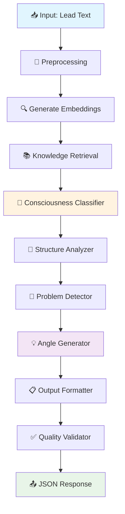
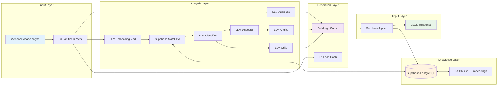
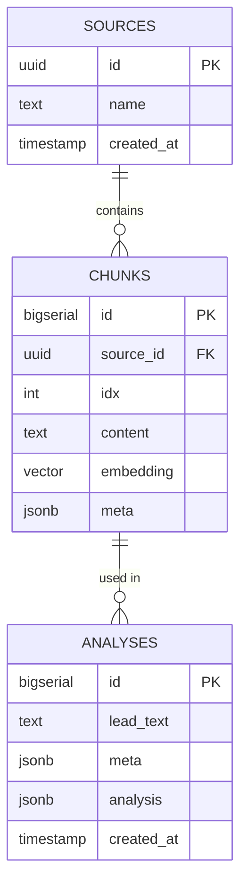
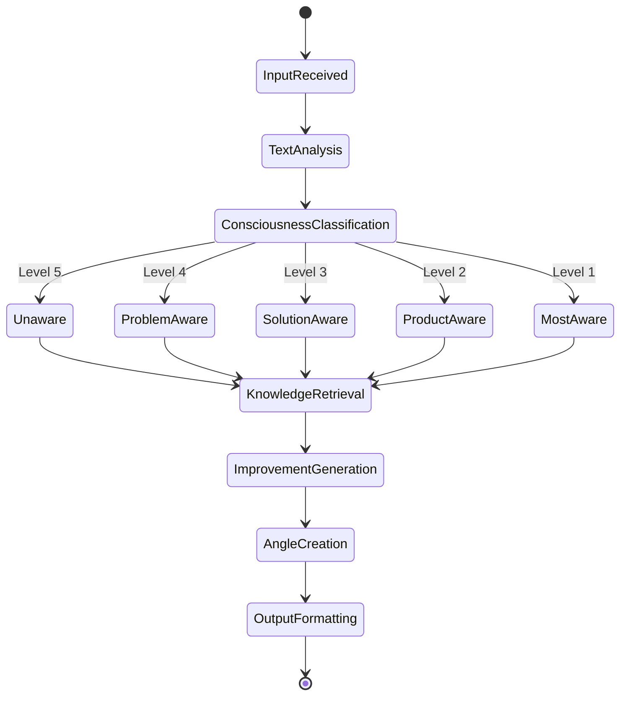
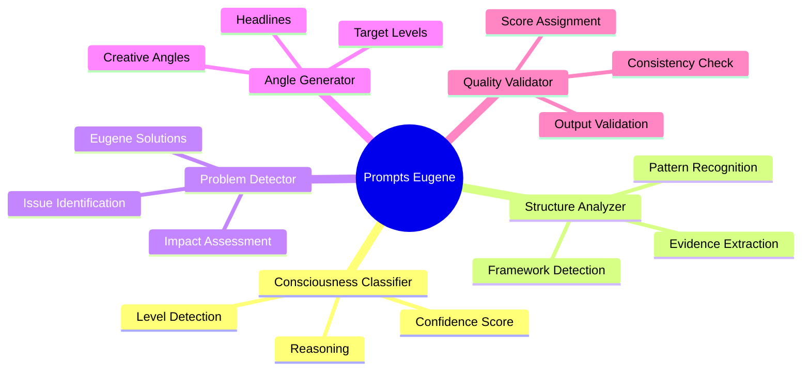
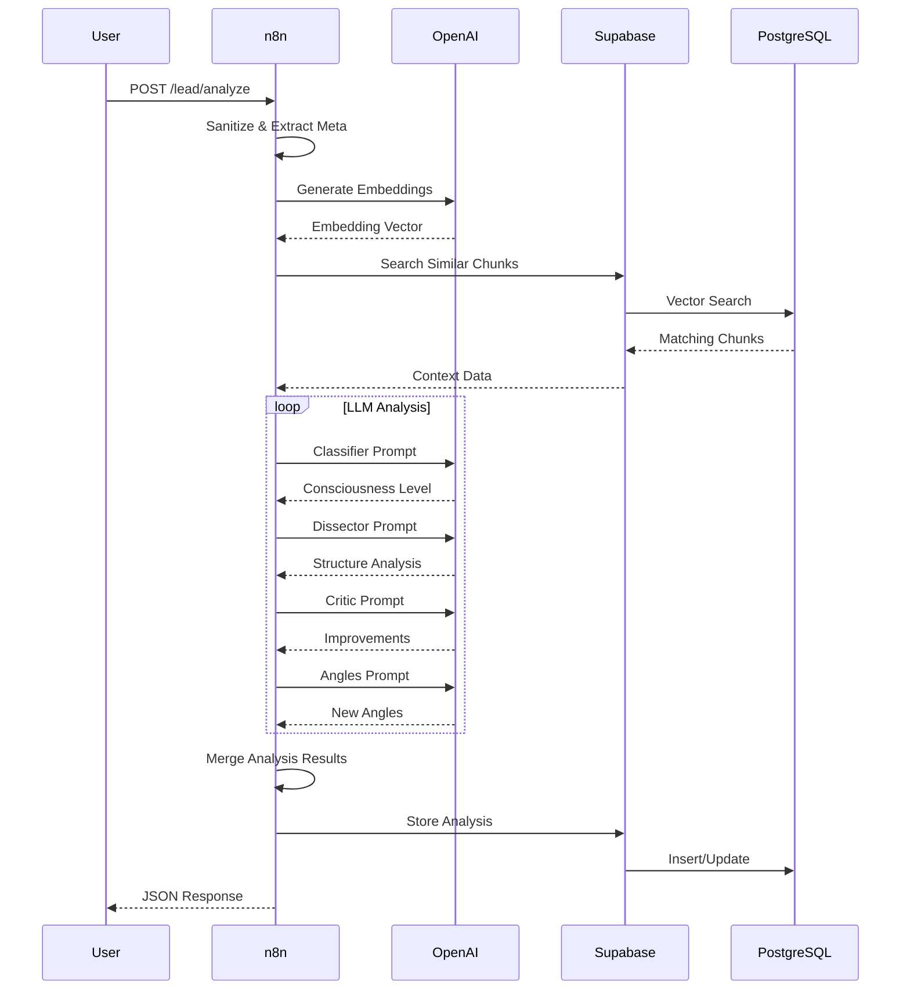

# Diagramas de Arquitetura - Clone Digital Eugene Schwartz

Este documento contém todos os diagramas Mermaid que ilustram a arquitetura e fluxos do sistema Clone Digital Eugene Schwartz.

## 1. Fluxo Principal do Sistema



## 2. Arquitetura Detalhada do n8n Workflow



## 3. Estrutura de Dados - Relacionamentos



## 4. Fluxo de Processamento de Consciência



## 5. Arquitetura de Prompts



## 6. Integração com Sistemas Externos



## 7. Monitoramento e Métricas

```mermaid
dashboard
    title "Sistema Eugene Schwartz - Dashboard"
    
    card "Análises Hoje" {
        value 47
        delta +12%
    }
    
    card "Tempo Médio" {
        value "23s"
        delta -5s
    }
    
    card "Precisão Nível" {
        value "87%"
        delta +2%
    }
    
    card "Satisfação" {
        value "4.6/5"
        delta +0.2
    }
    
    chart "Distribuição por Nível" {
        x-axis ["Nível 1", "Nível 2", "Nível 3", "Nível 4", "Nível 5"]
        y-axis "Quantidade" 0 --> 20
        bar [8, 15, 18, 12, 6]
    }
    
    chart "Performance Temporal" {
        x-axis ["00:00", "06:00", "12:00", "18:00", "24:00"]
        y-axis "Tempo (s)" 0 --> 60
        line [25, 22, 28, 31, 24]
    }
```

## 8. Legenda de Componentes

### Cores dos Componentes
- 🔵 **Azul**: Entrada de dados e interfaces
- 🟢 **Verde**: Saída e resultados finais  
- 🟠 **Laranja**: Processamento e análise
- 🟣 **Roxo**: Geração criativa e ângulos
- 🟡 **Amarelo**: Armazenamento e dados

### Símbolos
- 📥 **Input**: Entrada de dados
- 📤 **Output**: Saída de dados
- 🧠 **LLM**: Processamento de linguagem
- 📚 **Knowledge**: Base de conhecimento
- 🔍 **Search**: Busca e recuperação
- ⚙️ **Process**: Processamento interno
- 💾 **Storage**: Armazenamento persistente

---

## Observações Técnicas

### Escalabilidade
- Workflow n8n permite processamento paralelo
- PostgreSQL com pgvector otimizado para buscas vetoriais
- Cache de embeddings para evitar recálculos

### Modularidade  
- Cada nó do n8n é independente e testável
- Prompts versionados e configuráveis
- Estrutura de dados flexível via JSONB

### Observabilidade
- Logs detalhados em cada etapa
- Métricas de performance e qualidade
- Dashboard para monitoramento em tempo real

### Flexibilidade
- Suporte a múltiplos modelos LLM
- Configuração via variáveis de ambiente
- Extensível para novos tipos de análise